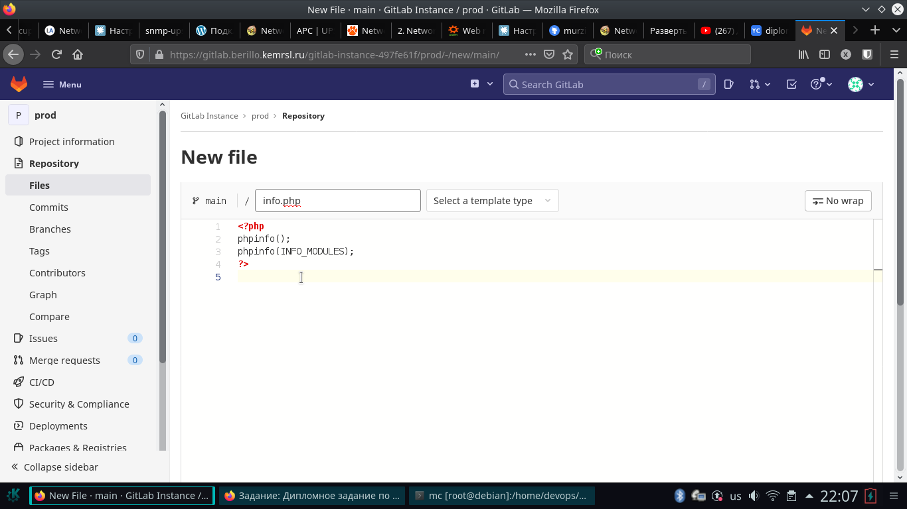
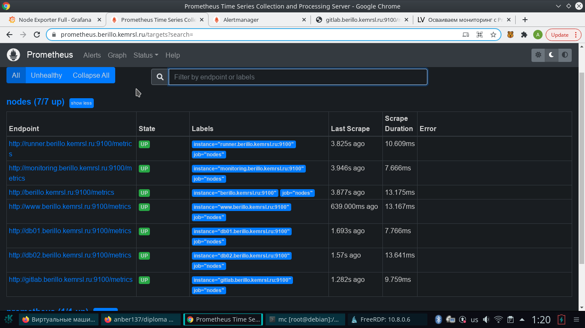
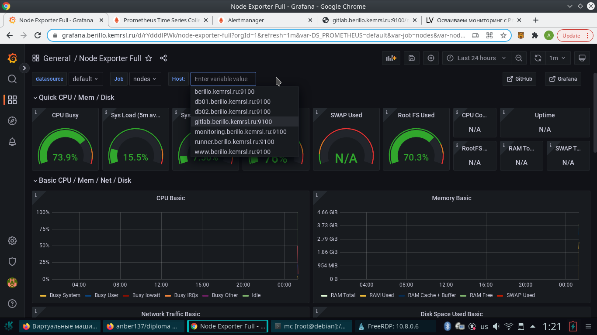

# Дипломный практикум в YandexCloud

## 1. Регистрация доменного имени

Зарегестрировал доменное имя: `berillo.kemrsl.ru`. Имеется доступ к доменному имени `kemrsl.ru` (редактирование записей DNS на `primery - DNS` сервере) и в качестве теста есть возможность в регистрации `sub` доменных имен.


В Yandex cloud получил статический ip адрес:

``` bash
#!/usr/bin/env bash
yc vpc address create --external-ipv4 zone=ru-central1-a --folder-id "b1gor3n8jb0hhgr1t7qd"
```
В результате:

```     
      5   address: 62.84.117.186
      6     zone_id: ru-central1-a
      9       type: EXTERNAL
```

## 2. Создание инфраструктуры

Использовал альтернативный вариант: `S3 bucket` в созданном `YC` аккаунте.

При попытке создания `S3` в одном скрипте с остальной инфраструктурой получил сообщение об ошибке:

```
Error: Failed to get existing workspaces: S3 bucket does not exist.
```

Разделил создание хранилища и все остальное на два разных наборов скриптов `terraform`. Запуск поместил в один `bash`.


```bash
#!/usr/bin/env bash

ssh-keygen -f "/root/.ssh/known_hosts" -R "62.84.117.186"

WORK_DIR=/home/devops/diploma

cd $WORK_DIR/diplom_s3_add
terraform init && terraform plan && terraform apply -auto-approve

cd $WORK_DIR/diploma
#terraform init -migrate-state
terraform init -reconfigure
terraform workspace new stage
terraform init && terraform plan && terraform apply -auto-approve
```

### Настройте workspaces

workspace использовал только `stage`.

```
terraform workspace new stage
```
Подготовил `bash` [скрипт](./scripts/destroy.sh) для выполнения `destroy`.

### Создайте VPC с подсетями в разных зонах доступности.

Зоны доступности и соответственно подсети исользовал две:

```
zone_names = ["ru-central1-a", "ru-central1-b"]
subnet_cidr = ["192.168.101.0/24", "192.168.102.0/24"]
```

Все виртуальные машины, кроме `db02` созданы в `ru-central1-a`.

### Убедитесь, что теперь вы можете выполнить команды terraform destroy и terraform apply без дополнительных ручных действий.

В ходе выполнения скрипта create.sh получаю сообщение: 

```
Apply complete! Resources: 3 added, 0 changed, 0 destroyed.
```


## 3. Установка Nginx и LetsEncrypt

Для выполнения пунктов 3 - 7 подготовлены скрипты `node01.tf - node07.tf` с характеристиками указанными в задании.
Первая нода имеет статический внешний `ip` адрес. Основной используемы образ: `ubuntu 20.04`.

Для дальнейшей установки через `ansible`, добавил скрипт [inventory.tf](./scripts/diploma/inventory.tf).
Подготовка `inventory` аналогично ДЗ 5.5. Для того, что бы все виртуальные машины успели поднятся, перед запуском `ansible` выполняется `sleep 100`.

Подготовил роль: `proxy_server`. Проверил, что все `A-записи` настроены на внешний адрес `proxy`: `62.84.117.186`.


## 4. Установка кластера MySQL

Внес соответствующие изменения описанные автором `geerlingguy` в `README.md`. Роль расчитана на `Ubuntu 14.04 and 16.04`, но с `Ubuntu 20.04` проблем не возникло. Создание базы данных, пользователя `wordpress` и назначение прав прописаны в [main.yml]/scripts/ansible/roles/mysql/defaults/main.yml).

Проверяю, что база `wordpress` успешно создана:

*** Все настройки и т. п. выполняются под правами root с сервера, который после сдачи дипломной работы будет зачищен ***


## 5. Установка WordPress

Подготовил роль для установки `WordPress` с соответствующими модулями `php` и подключением к ранее созданной БД. Используется web сервер `apache`. Конфигурационный файл `apache` создается из шаблона: `apache.conf.j2` и соответственно `WordPress` из `wp-config.php.j2`.

Проверяю, что `WordPress` установился и есть подключение к базе данных.


## 6. Установка Gitlab CE и Gitlab Runner

Отредактированы роли авторов `geerlingguy` для установки `Gitlab` и `Erik-jan Riemers` для установки `Gitlab Runner`.

В соответствии с описанием для `Gitlab` и `Gitlab Runner` указаны `registration_token` `runner`. 

Проверяю, что `gitlab` доступен по адресу: `gitlab.berillo.kemrsl.ru` и ssl сертификат действующий.


Проверяю `runner`


Создаю новую переменную `SSH_PRIVATE_KEY`, копирую ключ.


Создаю новый проект `prod`.

Построил pipeline доставки кода в среду эксплуатации:


```yaml
---
# https://gist.github.com/qutek/fcdc1aad92059c00ad9d7b93049d48dd
# https://superuser.com/questions/430994/rsync-as-another-user-www-data
before_script:
  - 'which ssh-agent || ( apt-get update -y && apt-get install openssh-client -y )'
  - eval $(ssh-agent -s)
  - ssh-add <(echo "$SSH_PRIVATE_KEY")
  - mkdir -p ~/.ssh
  - chmod 700 ~/.ssh
  - echo -e "Host *\n\tStrictHostKeyChecking no\n\n" > ~/.ssh/config

stages:
  - deploy

deploy-job:
  stage: deploy
  script:
    - rsync --rsync-path 'sudo -u www-data rsync' -e ssh --chmod=D0750,F0640 -ratv --progress --exclude='.git' --exclude='README.md' ./*  ubuntu@app.berillo.kemrsl.ru:/var/www/www.berillo.kemrsl.ru/wordpress/
```

В `before_script` устанавливается ssh, копируется сертификат, отключается запрос на принятия ключа.
С помощью команды rsync файлы доставляются в `app.berillo.kemrsl.ru` в директорию с `wordpress`. Владелец файлов - пользователь `www-data`. Устанавливается права доступа `--chmod=D0750,F0640` для файлов 640, для директорий 750. Включен прогресс, исключается .git и файл `README.md`. Включена рекурсия `-r`, дополнительная информация `-v`, `archive mode` `-a`, сохранение времени внесения изменений `-t`.


Создаю новый файл `info.php` со следюущим содержанием: 

```php
<?php
phpinfo();
phpinfo(INFO_MODULES);
?>
```



Выполняю `commit`.


Проверяю доступность информации о `php` и модулях по следующему `URL`: `www.berillo.kemrsl.ru/info.php`


## 7. Установка Prometheus, Alert Manager, Node Exporter и Grafana

Установка выполнена ролями.

Подключаюсь к `Grafana` по адресу: `grafana.berillo.kemrsl.ru`. Проверяю доступность.


Подключаюсь к `Prometheus` проверяю доступность. Часть `nodes` со `state down` по причине того, что некоторые виртуальные машины выключены в целях экономии.


Проверяю доступность `alertmanager`


Проверяю набор правил `Alert Manager`


Проверяю работоспособность правил на выключенных виртуальных машинах:


Проверяю `alerts` по `load average`.


Виртуальные машины не нагружались, изменил знак в условии алерта.

Включил все виртуальные машины:





